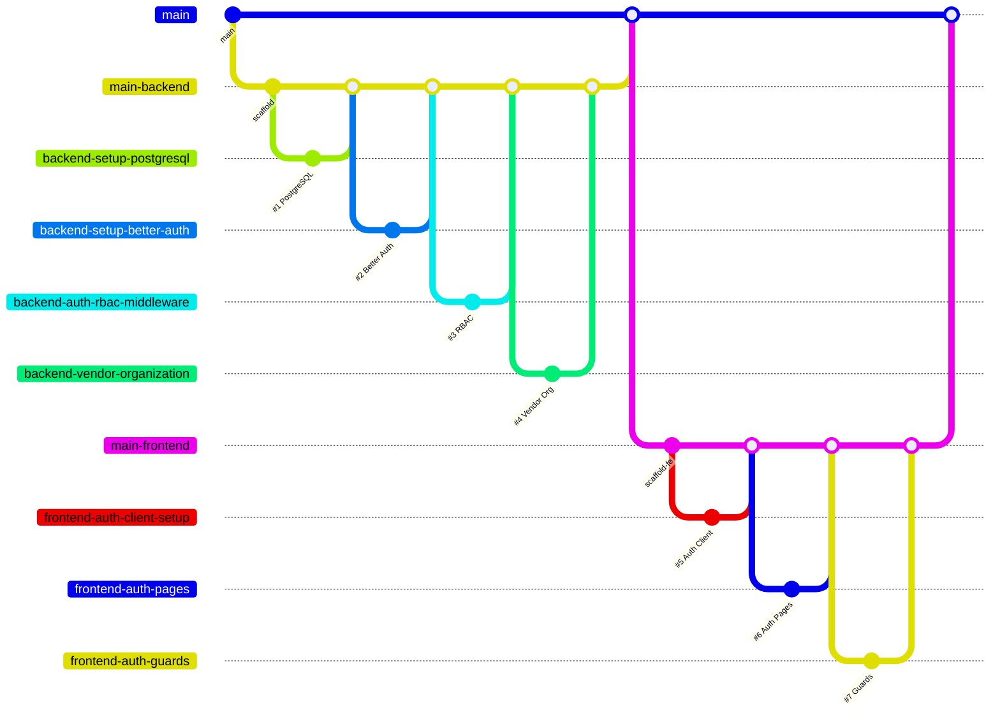

# Authentication Implementation Plan

Here are things to keep in mind while commiting those changes make the commits in the last two weaks time do not commit as todays commit and you may commit starting from there to today but do not make all of them today 

## Current State

**Backend** ([backend/src/app.ts](backend/src/app.ts) on `main-backend`): Express 5 + TypeScript scaffold with health endpoint. Still has **MongoDB/Mongoose** dependencies that need replacing with **PostgreSQL (pg)**. Uses `express.json()` globally which conflicts with Better Auth (must be mounted after the auth handler).

**Frontend** ([frontend/src/app/](frontend/src/app/) on `main-frontend`): Next.js 16 + TypeScript scaffold with empty `components/`, `hooks/`, `types/`, `services/` directories.

**Key Better Auth constraints from docs:**

- Express 5 uses `app.all("/api/auth/*splat", toNodeHandler(auth))` (not `/`*)
- `express.json()` must be mounted AFTER the Better Auth handler
- Must use ESM (`"type": "module"` in package.json or ESM tsconfig)
- PostgreSQL connects via `new Pool({ connectionString })` from `pg`
- Organization Plugin handles vendor multi-tenancy
- Admin Plugin handles super admin / moderator roles

---

## GitHub Issues and Implementation Order |

There is project GC Project in My Github Not A Repository a github Project USe that as Jira for tast management

### Phase 1: Backend Foundation (3 issues)

**Issue #1: `backend-setup-postgresql` -- Replace MongoDB with PostgreSQL**

- Branch: `backend-setup-postgresql` from `main-backend`
- Remove `mongoose` dependency, add `pg` + `@types/pg`
- Rewrite [backend/src/config/db.ts](backend/src/config/db.ts) to use `pg.Pool`
- Rewrite [backend/src/server.ts](backend/src/server.ts) to connect via Pool instead of mongoose
- Update [backend/.env.example](backend/.env.example) with `DATABASE_URL`
- Update package.json description
- PR -> `main-backend`

**Issue #2: `backend-setup-better-auth` -- Configure Better Auth core with Express**

- Branch: `backend-setup-better-auth` from `main-backend` (after #1 merges)
- Install `better-auth` and `pg`
- Create `backend/src/lib/auth.ts` -- Better Auth instance with:
  - PostgreSQL database via `new Pool({ connectionString })`
  - `emailAndPassword: { enabled: true }`
  - `socialProviders: { google: {...}, apple: {...} }`
  - Organization Plugin + Admin Plugin
- Update [backend/src/app.ts](backend/src/app.ts):
  - Mount `app.all("/api/auth/*splat", toNodeHandler(auth))` BEFORE `express.json()`
  - Move `express.json()` after the auth handler
- Run `npx @better-auth/cli migrate` to generate DB schema
- Add tests for `/api/auth/ok` health check
- PR -> `main-backend`

**Issue #3: `backend-auth-rbac-middleware` -- RBAC middleware and role enforcement**

- Branch: `backend-auth-rbac-middleware` from `main-backend` (after #2 merges)
- Create `backend/src/features/auth/` Clean Architecture structure:
  - `domain/` -- Role types/enums (`couple`, `vendor`, `admin`), permission interfaces
  - `use-cases/` -- Session validation, role checking logic
  - `infrastructure/` -- Better Auth session repository, org membership queries
  - `presentation/` -- Auth middleware (`requireAuth`, `requireRole("admin")`, `requireOrgRole("owner")`), auth routes if any custom ones needed
- Create `backend/src/shared/middlewares/auth.middleware.ts` for reusable guards
- Add unit tests for middleware and role checks
- Update `docs/api/auth.md` if any endpoint details change
- PR -> `main-backend`

### Phase 2: Backend Vendor Organization (1 issue)

**Issue #4: `backend-vendor-organization` -- Vendor registration creates Organization**

- Branch: `backend-vendor-organization` from `main-backend` (after #3 merges)
- Configure Better Auth Organization Plugin with custom access control:
  - Define permissions in `backend/src/lib/permissions.ts` using `createAccessControl`
  - Owner role: full access to vendor dashboard, staff invitations
  - Member role: R/W chat and schedule, read-only financial data
- Add database hook: when a user registers with role `vendor`, auto-create an Organization and assign them as Owner
- Implement staff invitation endpoint via Organization Plugin's invite flow
- Add tests for vendor registration -> org creation, staff invitation
- PR -> `main-backend`

### Phase 3: Frontend Auth (3 issues)

**Issue #5: `frontend-auth-client-setup` -- Better Auth client + types**

- Branch: `frontend-auth-client-setup` from `main-frontend`
- Install `better-auth` (client-side)
- Create `frontend/src/lib/auth-client.ts` with `createAuthClient` + organizationClient plugin
- Create `frontend/src/types/auth.ts` with TypeScript interfaces matching API docs (User, Session, Role types)
- Create `frontend/src/services/auth.service.ts` wrapping auth client methods
- PR -> `main-frontend`

**Issue #6: `frontend-auth-pages` -- Login, Register, and role-based routing**

- Branch: `frontend-auth-pages` from `main-frontend` (after #5 merges)
- Create `frontend/src/app/(auth)/login/page.tsx` -- email/password form + social login buttons (Google, Apple)
- Create `frontend/src/app/(auth)/register/page.tsx` -- registration form with role selection (Couple / Vendor)
- Create `frontend/src/app/(auth)/verify-email/page.tsx` -- email verification page
- Create `frontend/src/app/(auth)/layout.tsx` -- centered auth layout
- Implement role-based redirect after login:
  - `couple` -> `/dashboard`
  - `vendor` -> `/vendor/dashboard`
  - `admin` -> `/admin/dashboard`
- PR -> `main-frontend`

**Issue #7: `frontend-auth-guards` -- Session check, protected routes, 401 handling**

- Branch: `frontend-auth-guards` from `main-frontend` (after #6 merges)
- Create session-checking logic in root layout (`GET /api/auth/session` on app load)
- Create `frontend/src/components/auth-guard.tsx` -- client component that redirects unauthenticated users
- Create protected route groups:
  - `frontend/src/app/(couple)/dashboard/page.tsx` -- placeholder couple dashboard
  - `frontend/src/app/(vendor)/vendor/dashboard/page.tsx` -- placeholder vendor dashboard
  - `frontend/src/app/(admin)/admin/dashboard/page.tsx` -- placeholder admin dashboard
- Add global 401 response handler in auth service
- PR -> `main-frontend`

### Phase 4: Integration (1 PR)

After all backend and frontend issues are merged into their respective integration branches:

- Create PR: `main-backend` -> `main`
- Create PR: `main-frontend` -> `main`

---

## Git Flow Diagram

